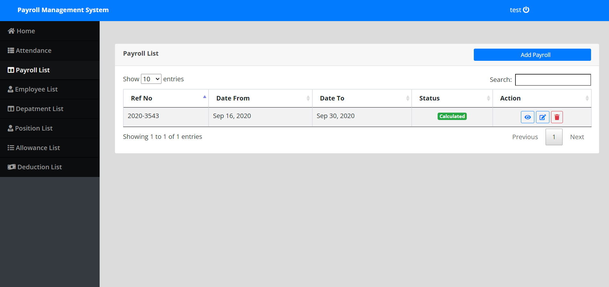

# Payroll Management System

**Learning Project: DBMS** [DOCX](https://github.com/Yashitasingh/payroll-management-system/raw/main/dbms.docx)

This project automates the calculation of monthly and quarterly compensations based on active working hours. The system ensures efficiency in payroll management, and reduces manual effort, consequently reducing errors.

### Tech Stack: -
The project was developed using XAMPP bundle as the development environment.

    - PHP: Back-end scripting to handle data processing and calculations

    - MySQL Workbench: Scripting SQL Queries and database design

### Demo

</img>

A working demo can be visited at: http://unipayrollmanagementsystem.liveblog365.com

Use demo id and password for acces: -

    id: test

    pass: test123

